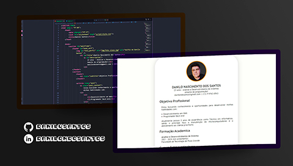
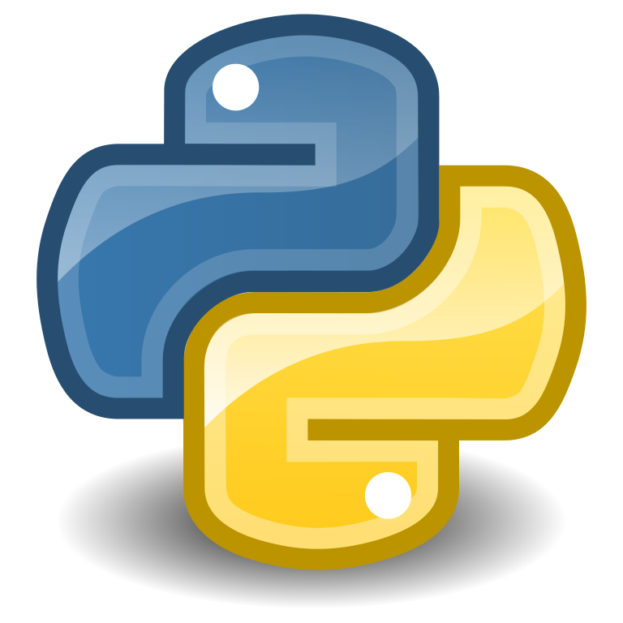

# Currículo Web para colocar em um Portfólio :notebook_with_decorative_cover:

# Versão resumida do currículo :scroll:

# DANILO NASCIMENTO DOS SANTOS

23 anos - Análise e Desenvolvimento de sistemas
Amante de programação!
danilondosantos@gmail.com | (13) 9 9763-0543

## Objetivo Profissional

Estou buscando conhecimento e oportunidades para desenvolver minhas habilidades com:

- Desenvolvimento em Web
- Programador Back-end.

Atualmente possuo 3 anos de experiência como Técnico em informática, sendo o principal foco a manutenção de microcomputadores e o atendimento ao cliente prioritário.

## Formação Acadêmica

**Análise e Desenvolvimento de Sistema**
2021 - 2024 (Em andamento)
Faculdade de Tecnologia de Praia Grande

## Cursos Extracurriculares

|  | Introdução a criação de websites com HTML5 e CSS3: Digital Innovation One 09/2021 a 10/2021 Descrição: Curso de introdução a linguagem de marcação HTML5 e CSS3, onde houve a criação de um exercício que resultou na criação desse currículo web. |
| ------------------------------------------------------------ | ------------------------------------------------------------ |
|  | **Introdução ao Git e GitHub:** Digital Innovation One 09/2021 a 09/2021 **Descrição:** Curso de introdução ao Git e a criação de repositório para versionar com o GitHub; |
|             | **Introdução ao Python3:** Alura Cursos 08/2021 a 09/2021 **Descrição:** Curso de introdução a linguagem Python3 e suas atualizações desde o python2 |

## Experiências Profissionais

#### PowerPC Informática

Auxiliar Técnico de Informática
07/2017 a 04/2020
**Descrição:** Manutenção de microcomputadores e notebooks; Atendimento remoto para solução de problemas com software; Atendimento ao cliente; Vendas de produtos relacionados à informática.

## Habilidades e Competências

- Responsabilidade
- Perseverança
- Harmonia no ambiente de trabalho
- Integridade
- Flexibilidade
- Cordial e Pontual

------

- [Linkedin](https://www.linkedin.com/in/danilondosantos)	[GitHub](https://www.github.com/danilusantos)	[Twitter](https://www.twitter.com/danilunsantos)	[E-Mail](danilondosantos@gmail.com)